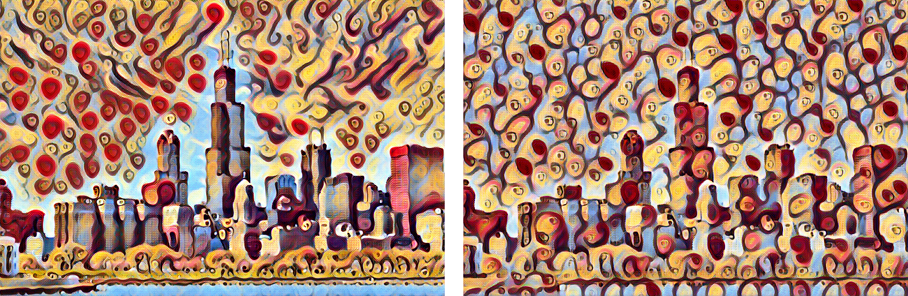
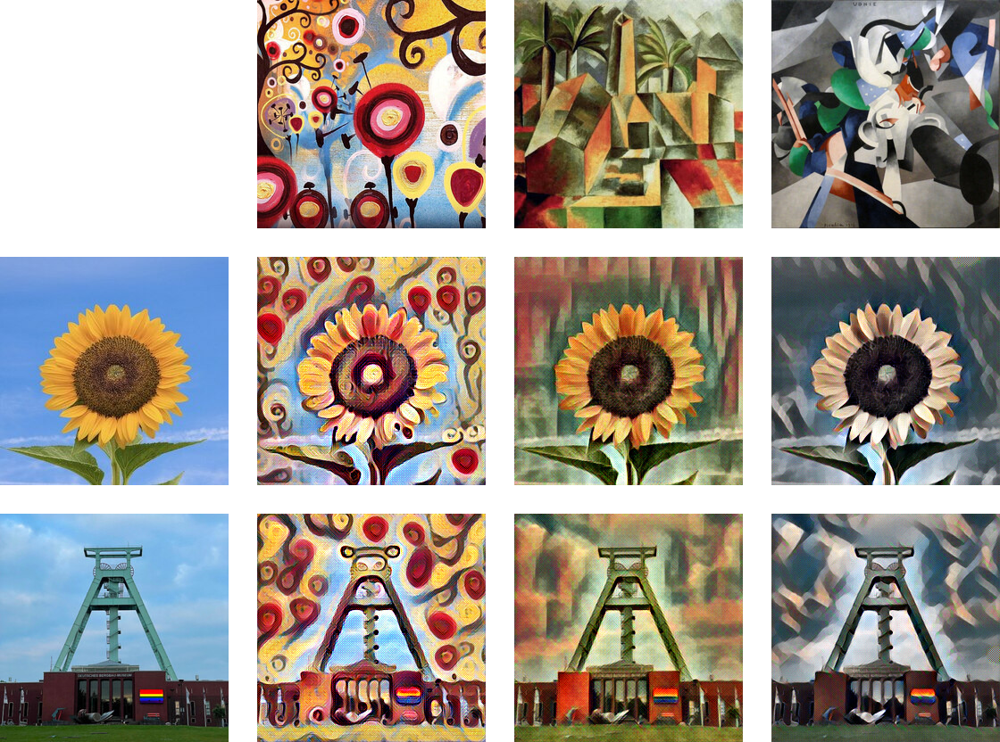
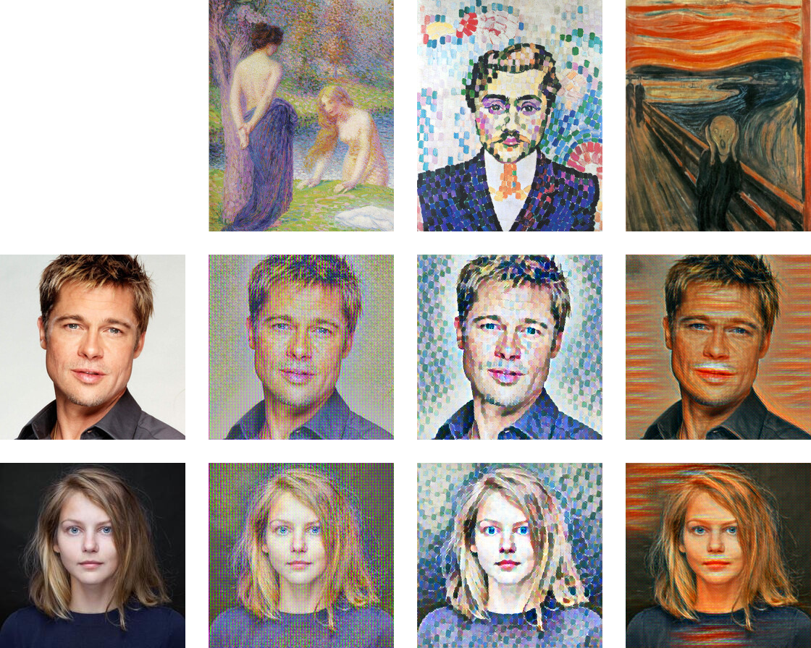

Fast Style Transfer (Johnson et al, 2016)
=========================================
In their 2016 article _Perceptual Losses for Real-Time Style Transfer and
Super-Resolution_, Johnson, Alahi, and Fei-Fei proposed a way to perform fast
neural style transfer. Their idea was to train, for a given style image, a
_style transfer network_ to convert any content image into a pastiche using a
single forward pass.  The proposed model uses an encoder-decoder architecture
with several residual blocks as a bottleneck, and it is trained to minimize a
weighted sum of the losses introduced by Gatys, Ecker, and Bethge in their
article _A Neural Algorithm of Artistic Style_.  It was soon suggested by
Ulyanov, Vedaldi, and Lempitsky in their note _Instance Normalization: The
Missing Ingredient for Fast Stylization_ that a simple change---replacing
batch normalization layers by instance normalization---would lead to a
significant improvement in visual results.

In this repository I aim to give a brief description and demonstration of
Johnson's style transfer model.  You can find the actual implementation used
here in the module [`johnson_2016`](
https://github.com/mdehling/nstesia/blob/main/src/nstesia/johnson_2016.py) of
my python package [`nstesia`](https://github.com/mdehling/nstesia/).

Network Architecture
--------------------
The style transfer network has three main parts: the encoder, the bottleneck,
and the decoder.  In addition, some pre- and post-processing is performed.
Below I give a description of the various parts of the network.  The given
output dimensions are based on input image size of 256x256, but note they are
provided for illustration only; the network is fully convolutional and
handles input images of any size.

### Pre-Processing
Input images are assumed to take RGB values in `0.0..255.0`. The
preprocessing layer centers the RGB values around their ImageNet means.  In
addition, a large amount of padding is applied to the images.  The padding is
calculated to make up for the reduction in spatial dimensions caused by the
residual blocks of the bottleneck.  The use of reflection padding in
particular reduces border artifacts associated with `same` padding.

```text
Layer                   Description                        Output Size
----------------------------------------------------------------------
preprocess              Pre-Processing                     256x256x3
rpad                    Reflection Padding (40x40)         336x336x3
```

### The Encoder
The encoder is composed of three convolutional blocks, each consisting of a
convolutional layer, a normalization layer, and a `relu` activation layer.
All convolutions use `same` padding.  The second and third block uses strided
convolutions to reduce the spatial dimensions by a total factor of `4`.

```text
Block / Layer           Description                        Output Size
----------------------------------------------------------------------
conv_block_1 / conv     Convolution (32, 9x9, stride 1)
             / norm     Batch/InstanceNormalization
             / act      Activation (ReLU)                  336x336x3

conv_block_2 / conv     Convolution (64, 3x3, stride 2)
             / norm     Batch/InstanceNormalization
             / act      Activation (ReLU)                  168x168x64

conv_block_3 / conv     Convolution (128, 3x3, stride 2)
             / norm     Batch/InstanceNormalization
             / act      Activation (ReLU)                  84x84x128
```

### The Bottleneck
The bottleneck comprises five residual blocks, each of which consists of five
layers and a residual connection.  In order, the layers are: convolution,
normalization, and `relu` activation, followed by another convolution and
another normalization layer.  The convolutional layers of the residual blocks
use no (or `valid`) padding and as a result reduce the spatial dimensions by
a total of 2 pixels on all four sides.  To match this reduction in dimensions,
cropping is performed in the residual connection.

```text
Block / Layer           Description                        Output Size
----------------------------------------------------------------------
res_block_1..5 / conv1  Convolution (128, 3x3, stride 1)
               / norm1  Batch/InstanceNormalization
               / relu1  Activation (ReLU)
               / conv2  Convolution (128, 3x3, stride 1)
               / norm2  Batch/InstanceNormalization
               + crop   Residual = Cropping (2x2)          80x80x128..
                                                           ..64x64x128
```

### The Decoder
The decoder roughly mirrors the encoder:  It is again composed of three
convolutional blocks, the first two of which consist of a convolutional layer,
a normalization layer, and a `relu` activation layer.  These convolutional
layers uses fractionally strided convolutions (or transposed convolutions) to
increase spatial dimensions.  The final convolutional block consists of a
convolution layer followed by a `tanh` activation layer.

```text
Block / Layer           Description                        Output Size
----------------------------------------------------------------------
conv_block_4 / conv     Convolution (64, 3x3, stride 1/2)
             / norm     Batch/InstanceNormalization
             / act      Activation (ReLU)                  128x128x64

conv_block_5 / conv     Convolution (32, 3x3, stride 1/2)
             / norm     Batch/InstanceNormalization
             / act      Activation (ReLU)                  256x256x32

conv_block_6 / conv     Convolution (3, 9x9, stride 1)
             / act      Activation (TanH)                  256x256x3
```

### Post-Processing
The final `tanh` activation layer of the decoder gives an output image with
rgb values in `-1.0..1.0`.  These values are multiplied by a factor `150.0`,
added with their ImageNet means, and finally cropped to the desired output
range `0.0..255.0`.

```text
Layer                   Description                        Output Size
----------------------------------------------------------------------
rescale                 Rescaling (factor 150.0)           256x256x3
postprocess             Post-Processing                    256x256x3
```

Training Method
---------------
Let $x_s$ be a chosen style image and denote by $T_s$ the _image 
transformation network_.  The goal is to produce, for any content image
$x_c$, a pastiche image $x_p = T_s(x_c)$ using a single forward pass of the
network.  The objective formulated to achieve this goal is to minimize a
weighted sum

$$
\mathcal{L}(x_c,x_s,x_p) = w_C\cdot\mathcal{L}_C(x_c,x_p) +
w_S\cdot\mathcal{L}_S(x_s,x_p) + w_V\cdot\mathcal{L}_V(x_p) \quad,
$$

where $\mathcal{L}_C$ and $\mathcal{L}_S$ denote the content and style loss as
introduced by Gatys et al, and $\mathcal{L}_V$ denotes the output image's
total variation.  For my implementation of these losses, see the module
[`gatys_2015`](
https://github.com/mdehling/nstesia/blob/main/src/nstesia/gatys_2015.py).

Training is performed for 2 epochs over the images of the Microsoft COCO/2014
dataset using an `adam` optimizer with a learning rate of `1e-3`.  All images
are resized to 256x256 and served in batches of 4.

Results
-------
This repository contains a python script [`train.py`](train.py) which takes a
style image and training parameters as input, downloads the training dataset,
performs training of the style transfer model, and finally saves the trained
model to disk.  The directory `saved/` contains some models trained in this
way using the default parameters.  To try these out yourself, have a look at
the notebook [`fast-style-transfer.ipynb`](fast-style-transfer.ipynb).  All
images below were produced using it.

> **Note**
> The images included here are lower quality jpeg files.  I have linked them
> to their lossless png versions.

I have chosen to use instance normalization as the default.  To show you why,
I have trained two versions of the style transfer network for the same style
image [`candy.jpg`](img/style/candy.jpg) using the same default parameters,
except one uses instance normalization while the other uses batch
normalization.  The image below shows two stylizations of the chicago
skyline: the one on the left was produced using instance normalization, while
the one on the right used batch normalization.

[
](img/results/instance-vs-batch-norm.png)

Here are some more examples of image stylizations usings the `candy`,
`cubism`, and `udnie` style transfer networks.  The results are reasonably
good, but could be improved by doing per-style parameter tuning.
Unfortunately, that process involves retraining the network multiple times
and is computationally expensive.

[
](img/results/content-style-matrix-1.png)

The following stylizations show the ability of the network to learn different
brush strokes.  Especially the `delaunay` style in the middle gives quite
pleasing results.  However, note the checkerboard artifacts, especially in the
first of these styles.  This pattern is a result of the use of strided 
convolutions for upsampling.  This issue was resolved in later work: see my
repository [`dumoulin-multi-style-transfer`](
https://github.com/mdehling/dumoulin-multi-style-transfer).

[
](img/results/content-style-matrix-2.png)

References
----------
* Johnson, Alahi, Fei-Fei - _Perceptual Losses for Real-Time Style Transfer
  and Super-Resolution_, 2016.
  [[pdf]](https://link.springer.com/content/pdf/10.1007/978-3-319-46475-6_43.pdf)
  [[suppl]](https://static-content.springer.com/esm/chp%3A10.1007%2F978-3-319-46475-6_43/MediaObjects/419974_1_En_43_MOESM1_ESM.pdf)
  [[code]](https://github.com/jcjohnson/fast-neural-style)
* Gatys, Ecker, Bethge - _A Neural Algorithm of Artistic Style_, 2015.
  [[pdf]](https://openaccess.thecvf.com/content_cvpr_2016/papers/Gatys_Image_Style_Transfer_CVPR_2016_paper.pdf)
* Ulyanov, Vedaldi, Lempitsky - _Instance Normalization: The Missing
  Ingredient for Fast Stylization_, 2016.
  [[arxiv]](https://arxiv.org/abs/1607.08022)
* Lin et al - _Microsoft COCO: Common Objects in Context_, 2014.
  [[www]](https://cocodataset.org/)
  [[arxiv]](https://arxiv.org/abs/1405.0312)
